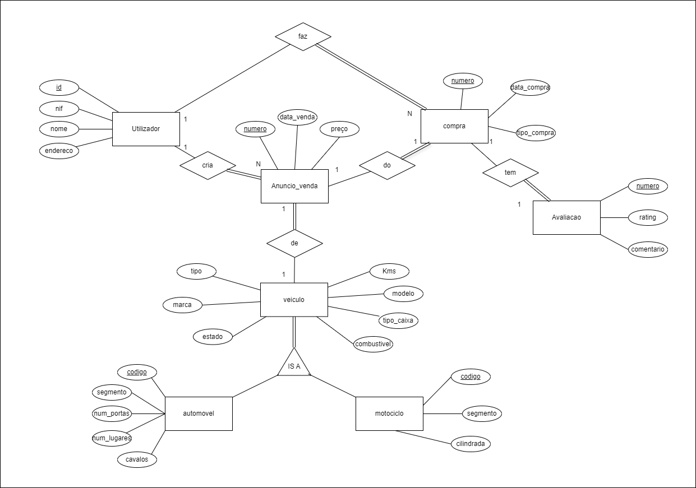
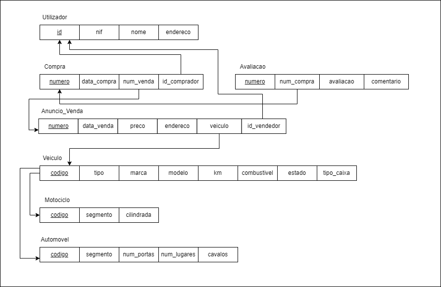

# BD: Trabalho Prático APF-T

**Grupo**: P2G7
- Adriano Costa, MEC: 108150
- Nuno Pinho, MEC: 108648


This template is flexible.
It is suggested to follow the structure, file links and images but add more content where necessary.

The files should be organized with the following nomenclature:

- sql\01_ddl.sql: mandatory for DDL
- sql\02_sp_functions.sql: mandatory for Store Procedure, Functions,... 
- sql\03_triggers.sql: mandatory for triggers
- sql\04_db_init.sql: scripts to init the database (i.e. inserts etc.)
- sql\05_any_other_matter.sql: any other scripts.

Por favor remova esta secção antes de submeter.

Please remove this section before submitting.

## Introdução / Introduction
 
A Carflex simplifica o processo de venda de veículos, permitindo que os utilizadores criem anúncios de venda para veículos, motociclos ou automoveis, e que também possam comprar estes anuncios podendo-os avaliar. Este projeto concentra-se na construção de uma base de dados robusta para gerir informações do utilizador, detalhes de veículo e anúncios de forma eficiente.
Um ponto importante de foco é na procura por anuncios, aqui é usado um filtro customizável com os atributos de cada veiculo.

Projeto realizado em python Flask, javascript e html para mostrar informação.
Base de Dados em SQL Server

Execução de procedures em

## ​Análise de Requisitos / Requirements
Requisitos Funcionais:

Contas e Sessões - Permitir que os utilizadores tenham a sua própria conta para vender os seus veículos.

Criação e Compra de Anúncios - Cada utilizador pode criar o seu anúncio para o seu carro ou mota, e também comprar de outros utilizadores.

Comentários e Avaliações - Após a compra, o comprador pode deixar comentários e avaliar a sua experiência de compra.

Filtragem Avançada de Pesquisa - Permitir pesquisa avançada usando vários atributos de veículos.


## DER - Diagrama Entidade Relacionamento/Entity Relationship Diagram

### Versão final/Final version



### APFE 

Adicionou-se os atributos username e pass_word na tabela Utilizador, de modo a permitir criar contas funcionais e sessões para os utilizadores.

## ER - Esquema Relacional/Relational Schema

### Versão final/Final Version



### APFE

As mesmas diferenças que no der.

## ​SQL DDL - Data Definition Language
Criação de tabelas

[SQL DDL File](sql/01_ddl.sql "01_ddl")

## SQL DML - Data Manipulation Language

[SQL Inserts iniciais](sql/04_dml_inserts.sql "04_dml_inserts")

[SQL Other querys](sql/05_dml_others.sql "05_dml_others")

Outras DML Querys foram usadas no ficheiros python dos folders persistence, e na app principal do flask.
Bem como a execução dos procedures e udf.

O tratamento da informação é depois feito no python e mandado para o html atraves de routes do flask com javascript.

[app.py](../app/app.py "app")

ex:
```sql
"INSERT INTO Utilizador(nif, nome, endereco, username, pass_word) VALUES (?, ?, ?, ?, ?)"
```

[anuncios.py](../app/persistence/Anuncios.py "anuncios")

ex:
```sql
EXEC anuncios_automovel;
```

[avaliacoes.py](../app/persistence/Avaliacoes.py "avaliacoes")

ex:
```sql
SELECT dbo.udf_AveragePriceByBrand(?)
```


### Formulario exemplo/Example Form


```sql
```

...

## Normalização/Normalization

De modo a separar motociclo de automovel, sendo que ambos são veiculos e contêm atributos de veículos decidimos separa-los e utilizar uma relação de is-a, simplificando a forma de aceder ás tabelas e separação de dados.

Foram também feitos alguns triggers de REMOVE para quando se remover uma tabela, as tabelas com relações serem também removidas e reduzir espaço

## Índices/Indexes

Não achamos necessário a criação de indíces, visto que a utilização das keys primarias bastaram.

## SQL Programming: Stored Procedures, Triggers, UDF

Como referido anteriormente, estes querys de execução são chamadas nos ficheiros python do folder persistence

[SQL Stored Procedures](sql/02_procedures.sql "SQLFileQuestion")

[SQL Triggers File](sql/03_triggers.sql "SQLFileQuestion")

[SQL UDFs](sql/06_udf.sql "SQLFileQuestion")

## Outras notas/Other notes

### Dados iniciais da dabase de dados/Database init data

[SQL DDL File](sql/01_ddl.sql "01_ddl") - criação de tabelas

[SQL Inserts iniciais](sql/04_dml_inserts.sql "04_dml_inserts") - inserts iniciais

### Apresentação

[Slides](Carflex-APfinal.pdf "Sildes")

[Video](carflexdemo.mp4)


 