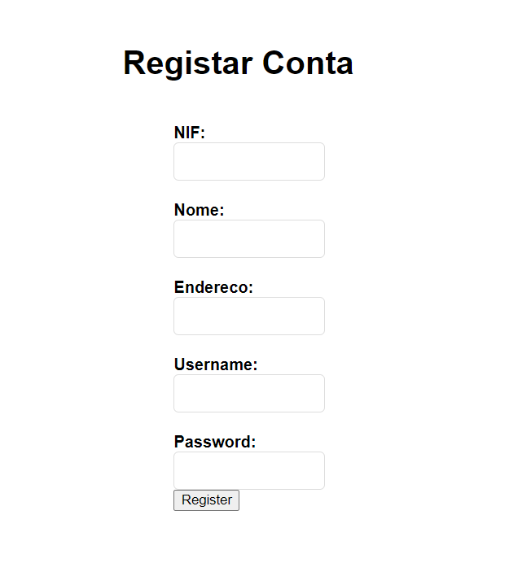
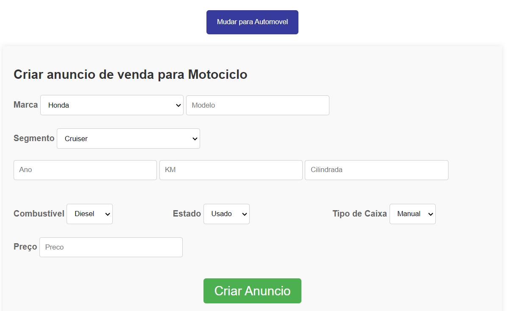

# BD: Trabalho Prático APF-T

**Grupo**: P2G7

- Adriano Costa, MEC: 108150
- Nuno Pinho, MEC: 108648

This template is flexible.
It is suggested to follow the structure, file links and images but add more content where necessary.

The files should be organized with the following nomenclature:

- sql\01_ddl.sql: mandatory for DDL
- sql\02_sp_functions.sql: mandatory for Store Procedure, Functions,...
- sql\03_triggers.sql: mandatory for triggers
- sql\04_db_init.sql: scripts to init the database (i.e. inserts etc.)
- sql\05_any_other_matter.sql: any other scripts.

Por favor remova esta secção antes de submeter.

Please remove this section before submitting.

## Introdução / Introduction

A Carflex simplifica o processo de venda de veículos, permitindo que os utilizadores criem anúncios de venda para veículos, motociclos ou automoveis, e que também possam comprar estes anuncios podendo-os avaliar. Este projeto concentra-se na construção de uma base de dados robusta para gerir informações do utilizador, detalhes de veículo e anúncios de forma eficiente.
Um ponto importante de foco é na procura por anuncios, aqui é usado um filtro customizável com os atributos de cada veiculo.

Projeto realizado em python Flask, javascript e html para mostrar informação.
Base de Dados em SQL Server

Execução de procedures em

## ​Análise de Requisitos / Requirements
Requisitos Funcionais:

Contas e Sessões - Permitir que os utilizadores tenham a sua própria conta para vender os seus veículos.

Criação e Compra de Anúncios - Cada utilizador pode criar o seu anúncio para o seu carro ou mota, e também comprar de outros utilizadores.

Comentários e Avaliações - Após a compra, o comprador pode deixar comentários e avaliar a sua experiência de compra.

Filtragem Avançada de Pesquisa - Permitir pesquisa avançada usando vários atributos de veículos.

## DER - Diagrama Entidade Relacionamento/Entity Relationship Diagram

### Versão final/Final version


### APFE

Adicionou-se os atributos username e pass_word na tabela Utilizador, de modo a permitir criar contas funcionais e sessões para os utilizadores.

## ER - Esquema Relacional/Relational Schema

### Versão final/Final Version


### APFE

As mesmas diferenças que no der.

## ​SQL DDL - Data Definition Language
Criação de tabelas

[SQL DDL File](sql/01_ddl.sql "01_ddl")

## SQL DML - D

## Data Manipulation Language

[SQL Inserts iniciais](sql/04_dml_inserts.sql "04_dml_inserts")

[SQL Other querys](sql/05_dml_others.sql "05_dml_others")

Outras DML Querys foram usadas no ficheiros python dos folders persistence, e na app principal do flask.
Bem como a execução dos procedures e udf.

O tratamento da informação é depois feito no python e mandado para o html atraves de routes do flask com javascript.

[app.py](../app/app.py "app")

ex:
```sql
"INSERT INTO Utilizador(nif, nome, endereco, username, pass_word) VALUES (?, ?, ?, ?, ?)"
```

[anuncios.py](../app/persistence/Anuncios.py "anuncios")

ex:
```sql
EXEC anuncios_automovel;
```

[avaliacoes.py](../app/persistence/Avaliacoes.py "avaliacoes")

ex:
```sql
SELECT dbo.udf_AveragePriceByBrand(?)
```


### Formulario exemplo/Example Form

Na realização desta secção do relatório apresentamos o screenshot de cada form assim como o código sql responsável pelo funcionamento do bloco, nos casos em que existem procedures apresentamos apenas o codigo sql e a funçao python que dá Excecute mesmo; e nos outros casos indicamos apenas a parte de sql relvante assim como a função  python a que o excerto pretence.


funçao validate_user em app.py

```py

 cursor.execute(
            'SELECT id, pass_word FROM Utilizador WHERE username = ?', (username,))

```  




função register_user em app.py

```py

cursor.execute("INSERT INTO Utilizador(nif, nome, endereco, username, pass_word) VALUES (?, ?, ?, ?, ?)",
                           (nif, nome, endereco, username, password))

```


função createAnuncioAutomovel() em Anuncios.py


```sql
CREATE PROCEDURE CreateAnuncioAutomovel
    @codigo NVARCHAR(8),
    @ano INT,
    @marca NVARCHAR(50),
    @modelo NVARCHAR(50),
    @km INT,
    @combustivel NVARCHAR(50),
    @estado NVARCHAR(50),
    @tipo_caixa NVARCHAR(50),
    @segmento NVARCHAR(50),
    @num_portas INT,
    @num_lugares INT,
    @cavalos INT,
    @preco INT,
    @id_vendedor INT
AS
BEGIN
    INSERT INTO Veiculo (codigo, ano, marca, modelo, km, combustivel, estado, tipo_caixa, tipo)
    VALUES (@codigo, @ano, @marca, @modelo, @km, @combustivel, @estado, @tipo_caixa, 'automovel')

    INSERT INTO Automovel (codigo, segmento, num_portas, num_lugares, cavalos)
    VALUES (@codigo, @segmento, @num_portas, @num_lugares, @cavalos)

    INSERT INTO Anuncio_venda (data_venda, preco, codigo_veiculo, id_vendedor)
    VALUES (GETDATE(), @preco, @codigo, @id_vendedor)
END
```



função createAnuncioMotociclo() em Anuncios.py

```sql
CREATE PROCEDURE CreateAnuncioMotociclo
    @codigo NVARCHAR(8),
    @ano INT,
    @marca NVARCHAR(50),
    @modelo NVARCHAR(50),
    @km INT,
    @combustivel NVARCHAR(50),
    @estado NVARCHAR(50),
    @tipo_caixa NVARCHAR(50),
    @segmento NVARCHAR(50),
    @cilindrada INT,
    @preco INT,
    @id_vendedor INT
AS
BEGIN
    INSERT INTO Veiculo (codigo, ano, marca, modelo, km, combustivel, estado, tipo_caixa, tipo)
    VALUES (@codigo, @ano, @marca, @modelo, @km, @combustivel, @estado, @tipo_caixa, 'motociclo')

    INSERT INTO Motociclo (codigo, segmento, cilindrada)
    VALUES (@codigo, @segmento, @cilindrada)

    INSERT INTO Anuncio_venda (data_venda, preco, codigo_veiculo, id_vendedor)
    VALUES (GETDATE(), @preco, @codigo, @id_vendedor)
END
```


funçao submitUserInfo() em app.py

```py

cursor.execute("UPDATE Utilizador SET nif=?, nome=?, endereco=?, username=? WHERE id=?",
                           (nif, nome, endereco, username, id))
```


função filter_anuncios() em Anuncios.py

```sql

CREATE PROCEDURE filter_anuncios
    @tipo nvarchar(50) = NULL,
    @marca nvarchar(50) = NULL,
    @segmento nvarchar(50) = NULL,
    @ano int = NULL,
    @km int = NULL,
    @combustivel nvarchar(50) = NULL,
    @estado nvarchar(50) = NULL,
    @tipo_caixa nvarchar(50) = NULL,
    @cavalos INT = NULL,
    @num_portas INT = NULL,
    @num_lugares INT = NULL,
    @cilindrada INT = NULL,
    @preco INT = NULL,
    @modelo nvarchar(50) = NULL
AS
BEGIN
    IF @tipo = 'automovel' OR @tipo IS NULL
    BEGIN
        SELECT Veiculo.codigo, numero, marca, modelo, ano, segmento, km, preco, tipo, num_portas, num_lugares, cavalos, combustivel, estado, tipo_caixa
        FROM Anuncio_venda 
        JOIN Veiculo ON Anuncio_venda.codigo_veiculo=Veiculo.codigo
        JOIN Automovel ON Veiculo.codigo=Automovel.codigo
        WHERE Anuncio_venda.numero NOT IN (SELECT num_venda FROM Compra)
        AND (@tipo IS NULL OR tipo = @tipo) 
        AND (@marca IS NULL OR marca = @marca) 
        AND (@segmento IS NULL OR segmento = @segmento)
        AND (@ano IS NULL OR ano >= @ano) 
        AND (@km IS NULL OR km >= @km)
        AND (@combustivel IS NULL OR combustivel = @combustivel)
        AND (@estado IS NULL OR estado = @estado)
        AND (@tipo_caixa IS NULL OR tipo_caixa = @tipo_caixa)
        AND (@cavalos IS NULL OR cavalos >= @cavalos)
        AND (@num_portas IS NULL OR num_portas = @num_portas)
        AND (@num_lugares IS NULL OR num_lugares = @num_lugares)
        AND (@preco IS NULL OR preco >= @preco)
        AND (@modelo IS NULL OR modelo LIKE '%' + @modelo + '%')
        
    END
    
    IF @tipo = 'motociclo' OR @tipo IS NULL
    BEGIN
        SELECT Veiculo.codigo, numero, marca, modelo, ano, segmento, km, preco, tipo, cilindrada, combustivel, estado, tipo_caixa
        FROM Anuncio_venda 
        JOIN Veiculo ON Anuncio_venda.codigo_veiculo=Veiculo.codigo
        JOIN Motociclo ON Veiculo.codigo=Motociclo.codigo
        WHERE Anuncio_venda.numero NOT IN (SELECT num_venda FROM Compra)
        AND (@tipo IS NULL OR tipo = @tipo) 
        AND (@marca IS NULL OR marca = @marca) 
        AND (@segmento IS NULL OR segmento = @segmento)
        AND (@ano IS NULL OR ano >= @ano) 
        AND (@km IS NULL OR km >= @km)
        AND (@combustivel IS NULL OR combustivel = @combustivel)
        AND (@estado IS NULL OR estado = @estado)
        AND (@tipo_caixa IS NULL OR tipo_caixa = @tipo_caixa)
        AND (@cilindrada IS NULL OR cilindrada >= @cilindrada)
        AND (@preco IS NULL OR preco >= @preco)
        AND (@modelo IS NULL OR modelo LIKE '%' + @modelo + '%')
    END
END
```
Explicação:

Este procedure foi desenvolvido para filtrar os anuncios de Automóveis e Motociclos de acordo com os seus vários parâmetros.
O procedure aceita vários parâmetros que são inicialmente todos de valor NULL, inicialmente ocorre uma verificação do @tipo que indicará
o tipo de veículo que o utilizador procura e daí há um select que adiciona novas rows de atributos presentes nesse tipo. Em termos de resultados, este procedure só retorna anúncios que não estejam na tabela "Compra", ou seja que ainda não foram vendidos e qualquer atributo que esteja com valor NULL é ignorado , o que não obirga o utilizador a preencher todos os campos. Adicionamos uma explicação nas querys mais elaboradas.


```sql

CREATE PROCEDURE filterAvaliacoes
    @tipo nvarchar(50) = NULL,
    @marca nvarchar(50) = NULL,
    @modelo nvarchar(50) = NULL,
    @sort nvarchar(50) = NULL
AS
BEGIN
    DECLARE @sql nvarchar(max);
    SET @sql = N'SELECT Veiculo.codigo, Compra.data_compra, Avaliacao.avaliacao, Avaliacao.comentario, Veiculo.marca, Veiculo.modelo FROM Avaliacao '
    SET @sql = @sql + N'JOIN Compra ON Avaliacao.num_compra = Compra.numero '
    SET @sql = @sql + N'JOIN Anuncio_venda ON Compra.num_venda = Anuncio_venda.numero '
    SET @sql = @sql + N'JOIN Veiculo ON Anuncio_venda.codigo_veiculo = Veiculo.codigo WHERE (1=1) '
    
    IF @tipo IS NOT NULL
        SET @sql = @sql + N' AND (Veiculo.tipo = @tipo) '
    IF @marca IS NOT NULL
        SET @sql = @sql + N' AND (Veiculo.marca = @marca) '
    IF @modelo IS NOT NULL
        SET @sql = @sql + N' AND (Veiculo.modelo LIKE ''%'' + @modelo + ''%'') '

    IF @sort IS NOT NULL
    BEGIN
        IF @sort = 'highest_rating'
            SET @sql = @sql + N' ORDER BY Avaliacao.avaliacao DESC '
        ELSE IF @sort = 'lowest_rating'
            SET @sql = @sql + N' ORDER BY Avaliacao.avaliacao ASC '
        ELSE IF @sort = 'most_recent'
            SET @sql = @sql + N' ORDER BY Compra.data_compra DESC '
        ELSE IF @sort = 'oldest'
            SET @sql = @sql + N' ORDER BY Compra.data_compra ASC '
    END

    EXEC sp_executesql @sql, N'@tipo nvarchar(50), @marca nvarchar(50), @modelo nvarchar(50)', @tipo, @marca, @modelo;
END

```

Explicação: Este procedure tem como função retornar as avaliações feitas por utilizadores que já fizem compras de veículos.
Este procedure funciona como o anterior no sentido em que se nenhum valor for dado em algum dos parâmetros este será tomado como NULL (default value). A query base deste procedure é um JOIN entre as tabelas Avaliacao, Compra, Anuncio_Venda e Veiculo e seleciona várias colunas destas tabelas. Os Filtros são aplicados se os parâmetros @tipo, @marca e @modelo não forem NULL. O  @sort permite ordenar os resultados por maior ou menor avaliação, ou por data de compra, mais recente ou mais antiga.

A query é construída dinamicamente e executada com sp_executesql para aplicar corretamente os filtros e a ordenação. Assim, é possível recuperar avaliações detalhadas conforme os critérios especificados.


```py
cursor.execute(f"""
            SELECT numero FROM Compra WHERE num_venda = ?
        """, (numero,)) #seleciona  o anuncio

cursor.execute(f""" 
            INSERT INTO Avaliacao 
            VALUES (?, ?, ?)
        """, (num_compra, avaliacao, comentario)) # fazer a avaliação
```


```sql
```

...

## Normalização/Normalization

De modo a separar motociclo de automovel, sendo que ambos são veiculos e contêm atributos de veículos decidimos separa-los e utilizar uma relação de is-a, simplificando a forma de aceder ás tabelas e separação de dados.

Foram também feitos alguns triggers de REMOVE para quando se remover uma tabela, as tabelas com relações serem também removidas e reduzir espaço

## Índices/Indexes

Não achamos necessário a criação de indíces, visto que a utilização das keys primarias bastaram.

## SQL Programming: Stored Procedures, Triggers, UDF

Como referido anteriormente, estes querys de execução são chamadas nos ficheiros python do folder persistence

[SQL Stored Procedures](sql/02_procedures.sql "SQLFileQuestion")

[SQL Triggers File](sql/03_triggers.sql "SQLFileQuestion")

[SQL UDFs](sql/06_udf.sql "SQLFileQuestion")

## Outras notas/Other notes

### Dados iniciais da dabase de dados/Database init data

[SQL DDL File](sql/01_ddl.sql "01_ddl") - criação de tabelas

[SQL Inserts iniciais](sql/04_dml_inserts.sql "04_dml_inserts") - inserts iniciais

### Apresentação

[Slides](Carflex-APfinal.pdf "Sildes")

[Video](carflexdemo.mp4)


 
